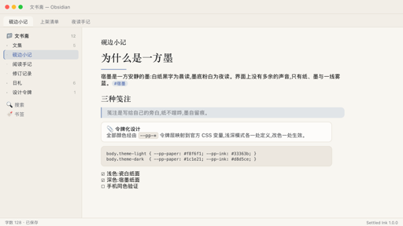
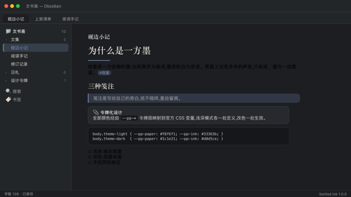
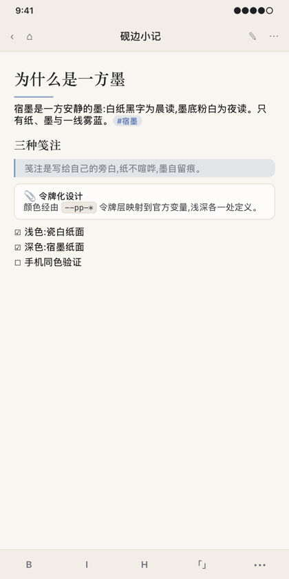
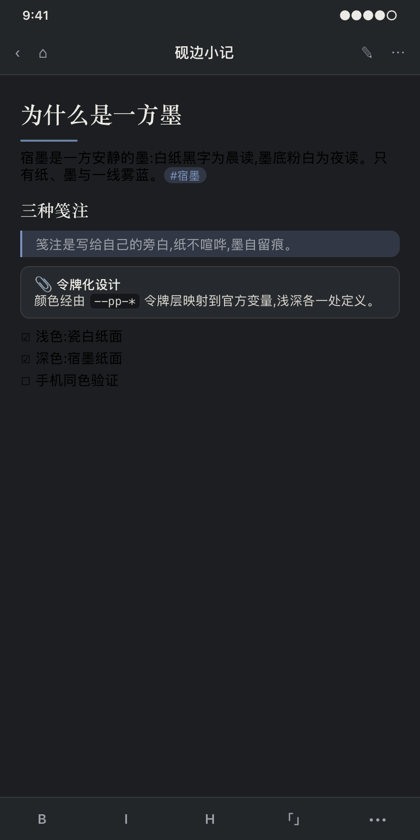

# Settled Ink

**A calm paper theme for Obsidian — warm porcelain paper in light mode, settled ink in dark. Built mobile-first.**



Settled Ink is built around a single idea: reading and writing in Obsidian should feel like a quiet sheet of paper. The light mode is a warm porcelain-white surface with graphite ink text; the dark mode is a deep settled-ink surface with soft paper-white text. One restrained mist-blue accent is the only color allowed to speak.



## Features

- **Dual color modes** — two hand-tuned palettes: *porcelain paper* for light and *settled ink* for dark. Both are complete, independently adjusted, and switch instantly with Obsidian's base theme toggle.
- **Mobile-first details** — the top navbar, keyboard toolbar and side drawer all match the paper palette on phones and tablets; touch targets are enlarged; pressed states replace hover states; heavy shadows are lifted on mobile for older devices.
- **Paper typography** — reading text uses a serif stack (Songti SC / STSong / Noto Serif SC, falling back to Georgia) with a relaxed 1.78 line-height and generous paragraph spacing. Interface chrome stays in the system sans font, so the UI remains crisp while the page reads like print.
- **The signature line** — the theme's only ornament: a short mist-blue rule under every H1, like the signature stroke at the end of a letter.
- **Tokenized colors** — every color flows through a small `--pp-*` token layer mapped onto official Obsidian CSS variables. Light and dark each define the token set exactly once, so a single edit restyles the entire theme.
- **Quiet details** — dashed fold-line horizontal rules, pill-shaped tags, rounded checkboxes, bordered code blocks, hairline dividers, tinted blockquotes and soft callout cards.

| Light · Porcelain mode | Dark · Settled Ink mode |
|---|---|
|  |  |

## Palette

| Mode | Surface | Text | Accent |
|---|---|---|---|
| Light · Porcelain | `#F8F6F1` | `#33363B` | Mist blue `#3C5AA6` |
| Dark · Settled Ink | `#1C1E21` | `#D8D5CE` | Mist blue `#7B93BE` |

The full token list for both modes lives at the top of [`theme.css`](theme.css), under the `--pp-*` layer.

## Installation

### From the community directory (recommended)

1. Open **Settings → Appearance → Themes → Manage → Community themes**.
2. Search for **"Settled Ink"**, click **Install**, then **Use**.

Updates arrive automatically through the community theme manager.

### Manual install

1. Download `theme.css` and `manifest.json` from the [latest release](https://github.com/liyaomingme/obsidian-settled-ink/releases/latest).
2. Create a folder `Settled Ink` inside your vault's `.obsidian/themes/` directory and put both files there.
3. Restart Obsidian, then enable the theme in **Settings → Appearance → Theme**.

## On mobile

The theme is verified on Obsidian for iOS and Android. The mobile navbar, keyboard toolbar and side drawer are all styled to the same paper palette in both light and dark modes — install it from the community theme browser on your phone the same way as on desktop.

## Compatibility

- Requires **Obsidian 1.4.0 or later** (minAppVersion in `manifest.json`).
- Only long-stable CSS variables and class names are used, keeping the theme honest across recent Obsidian versions.
- Works with the built-in editor, reading mode, callouts, math, tables, code blocks and graph view.

## Customization

Prefer a different accent color? Override the token layer with a small CSS snippet (Settings → Appearance → CSS snippets):

```css
/* warm amber accent, for example */
body.theme-light {
  --pp-accent: #8a5a2b;
  --pp-accent-strong: #6f4920;
}
body.theme-dark {
  --pp-accent: #cfa465;
  --pp-accent-strong: #e0b878;
}
```

If you prefer sans-serif reading text, remove the serif stack via `Appearance → Font` overrides, or set a snippet with:

```css
body {
  --font-text-override: -apple-system, "Segoe UI", "PingFang SC", sans-serif;
}
```

## License

[MIT](LICENSE) · Author **Qilinora** ([@liyaomingme](https://github.com/liyaomingme))
